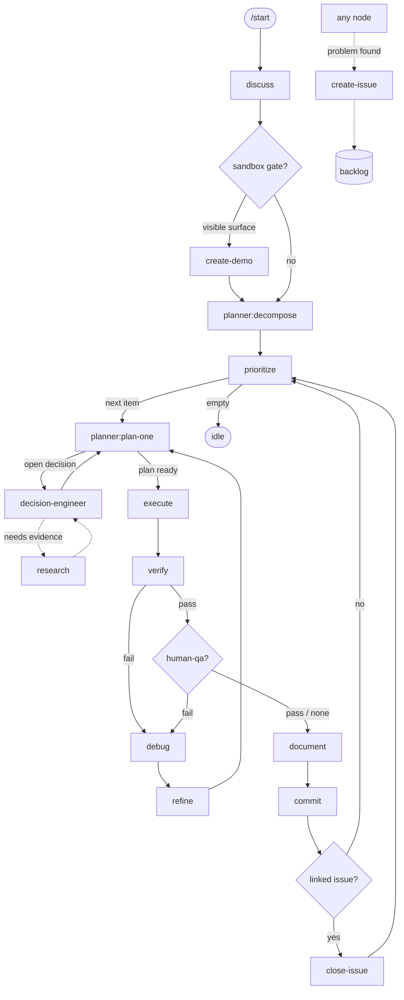

# Loop — the routing graph

The orchestrator reads this to route. **Topology is fixed** (it changes only with the package);
the live position lives in `state.json`. Nodes are skills/agents; edges are followed on a node's output.

## Routing table
| node | on output | next |
|---|---|---|
| `discuss` | spec drafted | `create-demo?` (sandbox gate) |
| `create-demo` | demo approved (checkpoint pass) | `planner:decompose` |
| `create-demo` | gate not triggered | `planner:decompose` |
| `planner:decompose` | roadmap → backlog | `prioritize` |
| `prioritize` | next item emitted | `planner:plan-one` |
| `prioritize` | backlog empty | `idle` (await steering) |
| `planner:plan-one` | open decisions | `decision-engineer` → back to `planner:plan-one` |
| `planner:plan-one` | plan ready | `execute` |
| `decision-engineer` | needs evidence | `research` → back to `decision-engineer` |
| `execute` | changelog | `verify` |
| `verify` | **pass** | `checkpoint:qa?` |
| `verify` | **fail** | `debug` |
| `debug` | root cause | `refine` |
| `refine` | correction plan | `planner:plan-one` → `execute` |
| `checkpoint:qa` | pass (or no human-qa criteria → skip) | `document` |
| `checkpoint:qa` | fail | `debug` |
| `document` | knowledge + Sessions updated | `commit` |
| `commit` | snapshot made | `close-issue?` |
| `close-issue` | issue closed (or no linked issue → skip) | `prioritize` (next item) |

Side doors (callable from anywhere): `create-issue` → backlog · `research` (service).

## Item-complete tail
`verify`(pass) → `checkpoint:qa?` → `document` → `commit` → `close-issue?` → `prioritize`.
The item's backlog done-flip and the `handoff.md` rewrite happen **before** `commit` (it captures them);
`close-issue` is the only post-commit step.

## Diagram

